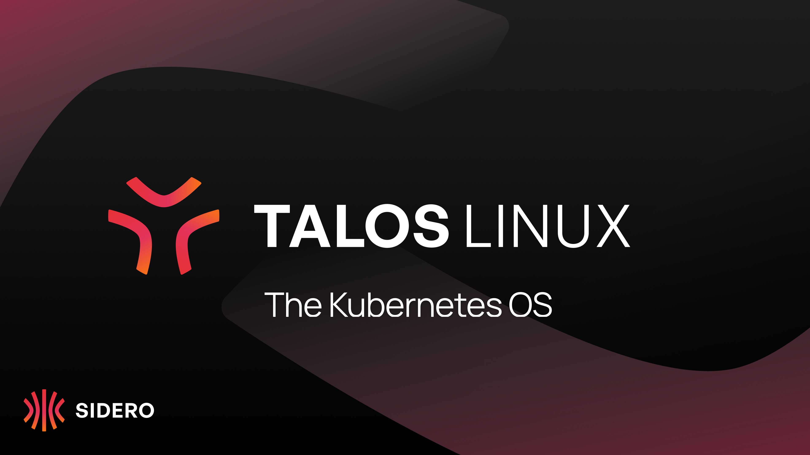
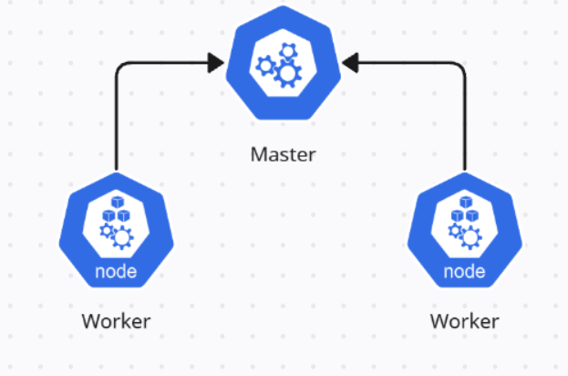

<div align="center">

# ☸️ Kubernetes Ops Notes


<p align="center">
  <b>Dokumentasi perjalanan, konfigurasi, dan "contekan" setup Cluster Kubernetes & Talos OS.</b><br>
  <i>Ditulis menggunakan Obsidian, disimpan untuk keabadian.</i>
</p>


</div>

---

## 🛠️ Tech Stack & Tools

Kumpulan teknologi yang dibahas atau digunakan dalam repositori ini:

<div align="center">

<a href="https://kubernetes.io/">
  
</a>
<br/>
<a href="https://proxmox.com/">
  
</a>
<a href="https://www.talos.dev/">
  
</a>
<a href="https://obsidian.md/">
  
</a>

</div>

---

## 🗺️ Navigation Hub

Langsung loncat ke topik yang kamu butuhkan. Gak perlu *scrolling* lama-lama.

### 🏗️ Installation & Setup

| Topik | Deskripsi | Link |
| :--- | :--- | :---: |
| **K8s Native** | Panduan instalasi manual Kubernetes v1.34 (Kubeadm) | [➡️ Baca](./Installation/Installation%20K8s%20Native%20(v1.34).md) |
| **Talos Linux** | Setup modern OS immutable (Talos) di atas Proxmox | [➡️ Baca](./Installation/Talos/Setup%20Talos%20OS.md) |

### 🚑 Operations & Troubleshooting

> *"If it breaks, we fix it."*

* [❌ Troubleshoot Log](./Installation/Troubleshoot.md) - Kumpulan error, solusi, dan drama saat instalasi.

---

## 📸 Sneak Peek

Berikut adalah tampilan topologi atau proses yang didokumentasikan:

<div align="center">
  
  
</div>

---

## ⚡ Quick Cheatsheet

Beberapa command sakti yang sering lupa:

```bash
# Cek Nodes di Talos
talosctl -n <IP> dashboard

# Generate Kubeconfig (Talos)
talosctl kubeconfig . --talosconfig ./talosconfig --endpoints <IP-MASTER>

# Reset Cluster (Kubeadm)
kubeadm reset -f && iptables -F && iptables -t nat -F